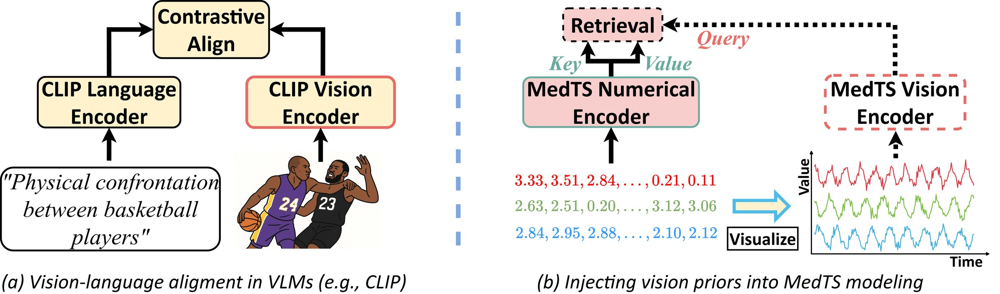
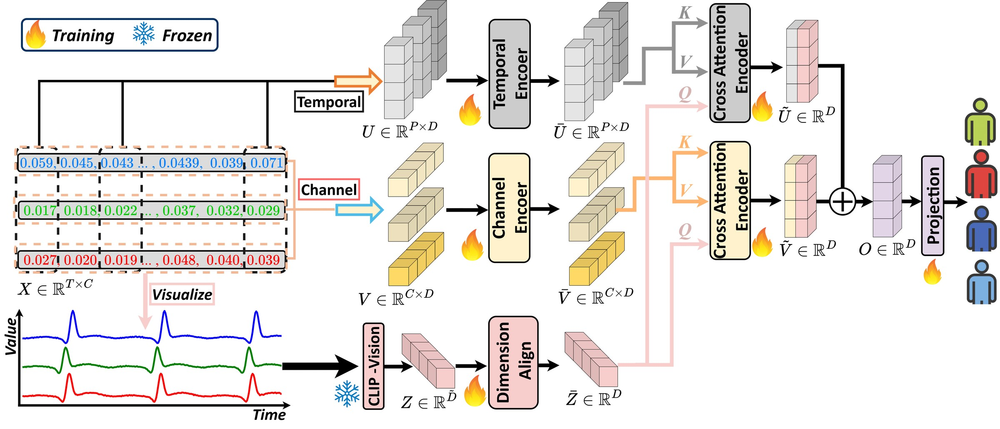
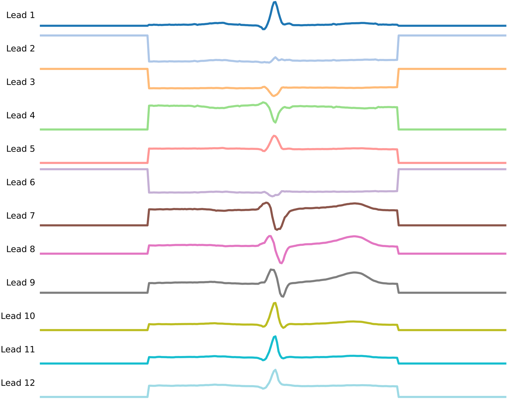
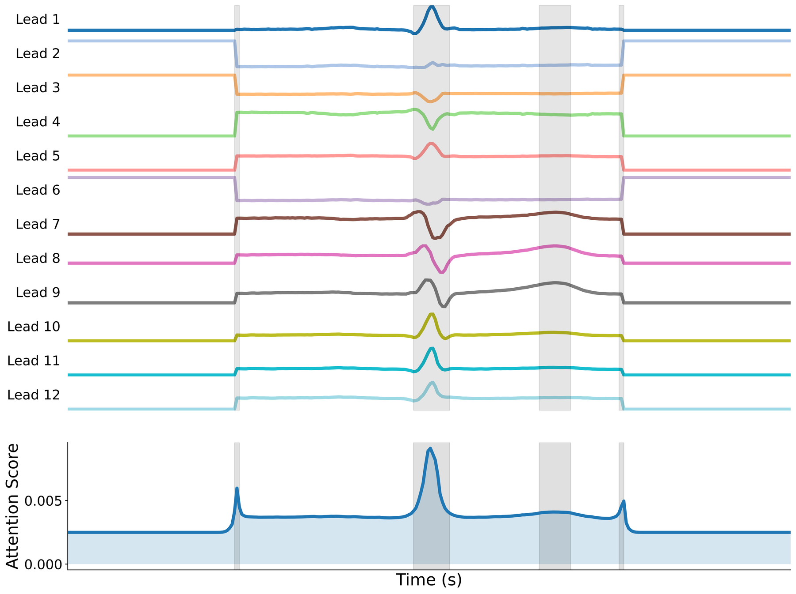
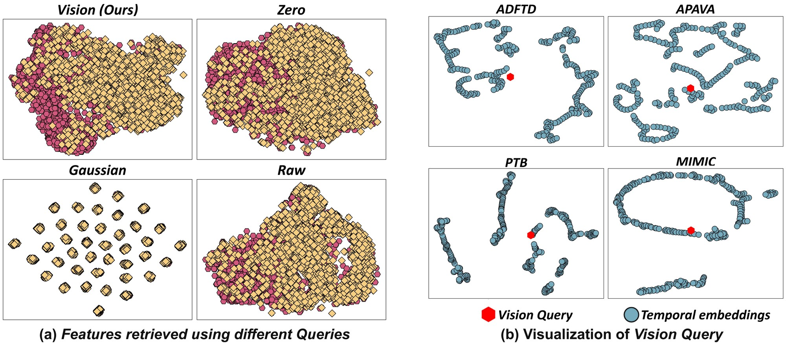
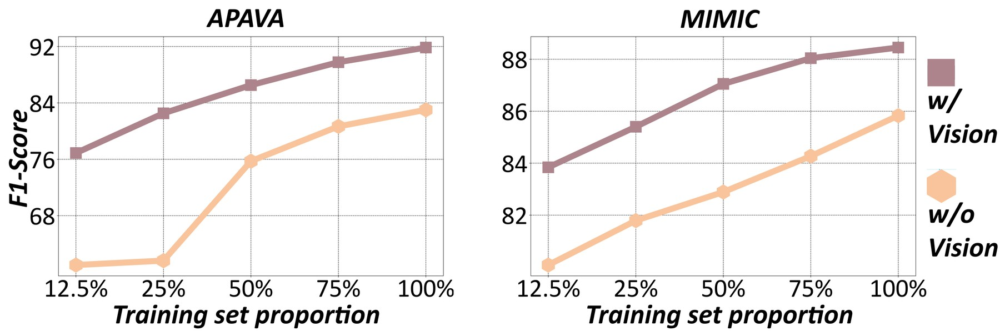
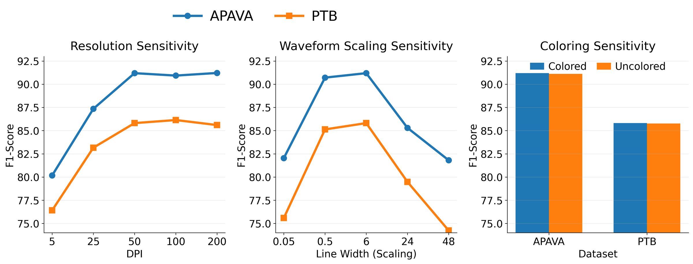

<div align="center">

# Revitalizing Medical Time Series with Vision-Informed Retrieval

### A Vision-Language Perspective

[](https://neurips.cc/)
[](https://openreview.net/forum?id=KUlrtLsdT8)
[](https://www.python.org/)
[](https://pytorch.org/)
[](LICENSE)

**Guoqi Yu, Juncheng Wang, Shujun Wang<sup>&#9993;</sup>**  
Department of Biomedical Engineering and Sports Technology, The Hong Kong Polytechnic University



</div>

> **TL;DR** &nbsp; Clinicians diagnose EEG and ECG by *looking at waveforms*, while deep MedTS models only see numbers. ViRe renders every recording as a waveform image, encodes it with a **frozen CLIP vision encoder**, and uses the embedding as a morphology-aware **Vision Query** that retrieves the relevant temporal and channel evidence from the numerical representation.

---

## 📰 News

- **[2026.09]** Official code release: training scripts for all six benchmarks, the visualization operator, reference training logs, and precomputed CLIP features.
- **[2026]** ViRe is accepted at **NeurIPS 2026**.

## 💡 Motivation

Routine clinical tasks such as Alzheimer's screening, Parkinson's detection and myocardial-infarction diagnosis are cast as medical time series (MedTS) classification. Existing models, from CNNs and RNNs to modern Transformers, treat each recording purely as a numerical matrix. In clinical practice, however, EEG and ECG are reviewed as **waveforms**: P–QRS–T complexes, ST-segment deviations, epileptiform discharges and cross-channel co-activations are recognized visually before they are summarized into reports. Numerics-oriented representations therefore miss the morphology-centric structure on which the diagnostic criteria are built.

Vision-language models offer a shortcut to this structure. Trained with natural-language supervision, their vision encoders organize images around human-describable concepts, so a rendered waveform is embedded in terms of spikes, trends and fluctuations rather than raw pixels. ViRe asks a simple question: **can such a frozen vision prior reshape the representations that MedTS models learn from numbers?**

## 🔍 Method

<div align="center">

</div>

ViRe keeps a dual view of every recording and lets the two views interact through retrieval:

1. **Numerical view.** The signal is tokenized along two complementary axes, a *Temporal embedding* (segments across all channels) and a *Channel embedding* (the whole trajectory of each channel), and encoded by two Transformer encoders.
2. **Waveform view.** A deterministic **visualization operator** stacks the channels into one decoration-free waveform image, which a **frozen** CLIP vision encoder turns into a compact embedding. No fine-tuning and no auxiliary objective are involved.
3. **Vision-Informed Retrieval.** The projected CLIP embedding is the single shared **Query** of two cross-attention blocks whose Keys and Values are the temporal and channel tokens. Vision decides *what to retrieve*; every retrieved feature remains numerical. The two summaries are added and projected to the class logits.

## ✨ Highlights

- 🏆 **State of the art on 5 of 6 subject-independent benchmarks** (three EEG, three ECG) with an average relative gain of **6.42%** over Medformer, including **16.37%** on APAVA.
- 🧠 **The gain comes from the vision prior, not from capacity.** Content-free queries (all-zero or Gaussian) add at most 1.92%, an ImageNet-pretrained ViT adds 0.34%, while the CLIP vision encoder adds 7.72% on the same architecture.
- 📉 **Data-efficient.** The advantage over the numerical-only model is largest when only a fraction of the training subjects is available.
- 🔎 **Interpretable.** Retrieval attention concentrates on high-curvature, QRS-aligned intervals, and the frozen visual space decodes clinical attributes such as PR interval and prolonged QT on MEETI.
- ⚡ **Cheap to train.** CLIP features are computed once and cached, so a training step is faster and lighter than Medformer's.

## 📊 Main Results

Subject-independent classification on three EEG and three ECG benchmarks. Each entry is the average of Accuracy, Precision, Recall, F1, AUROC and AUPRC over five seeds; best in **bold**, second best in *italics*.

| Model | APAVA | ADFTD | TDBrain | PTB | PTB-XL | MIMIC | Mean |
|:--|--:|--:|--:|--:|--:|--:|--:|
| Autoformer | 70.71 | 46.43 | 89.52 | 70.86 | 57.53 | 79.69 | 69.12 |
| FEDformer | 77.21 | 48.20 | 80.98 | 75.90 | 56.83 | 86.79 | 70.98 |
| Informer | 71.36 | 50.04 | 91.64 | 80.62 | 67.84 | 86.94 | 74.74 |
| iTransformer | 77.23 | 51.71 | 77.63 | *84.95* | 64.45 | 87.11 | 73.85 |
| MTST | 69.94 | 47.89 | 79.35 | 76.80 | 68.70 | 87.52 | 71.70 |
| Nonformer | 70.70 | 50.94 | 91.07 | 79.58 | 66.78 | 86.35 | 74.24 |
| PatchTST | 65.89 | 45.56 | 81.94 | 75.35 | **69.90** | 86.79 | 70.91 |
| Reformer | 77.02 | 53.19 | 90.84 | 79.51 | 68.04 | *87.90* | 76.08 |
| Transformer | 74.42 | 52.09 | 90.34 | 78.69 | 66.73 | 87.01 | 74.88 |
| Medformer | *79.74* | *54.63* | *91.91* | 84.69 | 69.28 | 87.14 | *77.90* |
| **ViRe (ours)** | **92.79** | **59.83** | **95.54** | **89.08** | *69.47* | **90.68** | **82.90** |

<details>
<summary><b>Per-metric results of ViRe (mean ± std over five seeds)</b></summary>
<br>

| Dataset | Accuracy | Precision | Recall | F1 | AUROC | AUPRC |
|:--|--:|--:|--:|--:|--:|--:|
| APAVA | 91.43 ± 1.03 | 91.07 ± 1.16 | 91.40 ± 0.79 | 91.19 ± 1.01 | 95.99 ± 0.34 | 95.67 ± 0.44 |
| ADFTD | 57.83 ± 1.82 | 56.44 ± 2.49 | 53.75 ± 3.04 | 54.02 ± 3.19 | 76.59 ± 1.62 | 60.33 ± 2.78 |
| TDBrain | 93.96 ± 0.75 | 94.03 ± 0.72 | 93.96 ± 0.75 | 93.96 ± 0.75 | 98.65 ± 0.34 | 98.68 ± 0.35 |
| PTB | 88.26 ± 1.12 | 89.54 ± 0.78 | 83.82 ± 1.75 | 85.81 ± 1.52 | 93.95 ± 0.28 | 93.08 ± 0.72 |
| PTB-XL | 73.12 ± 0.24 | 66.07 ± 0.60 | 59.62 ± 0.60 | 61.59 ± 0.47 | 89.65 ± 0.17 | 66.76 ± 0.26 |
| MIMIC | 88.61 ± 0.12 | 88.55 ± 0.13 | 88.56 ± 0.15 | 88.54 ± 0.12 | 95.08 ± 0.06 | 94.76 ± 0.11 |

The training logs behind these numbers are provided in [`logs/`](logs/), one file per benchmark.
</details>

<details>
<summary><b>Ablations (Accuracy / F1, average relative gain over the numerical-only model)</b></summary>
<br>

| Variant | ADFTD | APAVA | PTB | MIMIC | Avg. gain |
|:--|--:|--:|--:|--:|--:|
| w/o retrieval (numerical only) | 54.79 / 51.73 | 83.86 / 82.45 | 81.45 / 74.58 | 84.92 / 84.81 | – |
| Zero query | 54.72 / 51.23 | 84.34 / 83.73 | 84.62 / 80.21 | 86.13 / 86.06 | +1.92% |
| Gaussian query | 54.46 / 51.54 | 82.89 / 81.65 | 82.83 / 77.34 | 86.50 / 86.44 | +0.76% |
| Add fusion | 56.67 / 53.53 | 85.95 / 85.45 | 84.81 / 81.26 | 87.57 / 87.49 | +4.05% |
| Concat fusion | 56.86 / 53.55 | 84.23 / 83.02 | 83.60 / 79.13 | 87.88 / 87.81 | +3.02% |
| ViT, random init | 37.39 / 27.34 | 80.62 / 77.18 | 80.65 / 73.50 | 83.67 / 83.58 | −11.81% |
| ViT, ImageNet | 52.21 / 50.55 | 84.48 / 84.86 | 82.06 / 75.72 | 86.52 / 86.42 | +0.34% |
| **ViRe** | **57.83 / 54.02** | **91.43 / 91.19** | **88.26 / 85.81** | **88.61 / 88.54** | **+7.72%** |
</details>

## 🚀 Getting Started

### 1. Environment

```bash
git clone https://github.com/Levi-Ackman/ViRe.git
cd ViRe
conda create -n vire python=3.10 -y && conda activate vire
pip install -r requirements.txt
```

### 2. Datasets

| Dataset | Modality | Task | Source |
|:--|:--|:--|:--|
| APAVA | EEG | Alzheimer's disease (2 classes) | preprocessed by [Medformer](https://github.com/DL4mHealth/Medformer) |
| ADFTD | EEG | Alzheimer's / frontotemporal dementia / healthy (3 classes) | preprocessed by [Medformer](https://github.com/DL4mHealth/Medformer) |
| TDBrain | EEG | Parkinson's disease (2 classes) | raw data from [Brainclinics](https://brainclinics.com/resources/), then `data_preprocessing/TDBRAIN_preprocessing.ipynb` |
| PTB | ECG | Myocardial infarction (2 classes) | preprocessed by [Medformer](https://github.com/DL4mHealth/Medformer) |
| PTB-XL | ECG | Diagnostic superclasses (5 classes) | preprocessed by [Medformer](https://github.com/DL4mHealth/Medformer) |
| MIMIC | ECG | Heart disease vs. healthy (2 classes) | raw data from [MIMIC-IV-ECG](https://physionet.org/content/mimic-iv-ecg/1.0/), then `data_preprocessing/MIMIC-IV_preprocessing.ipynb` |

All benchmarks follow the **subject-independent** protocol: subjects are assigned to the training, validation or test set before any preprocessing, so every test sample comes from an unseen patient. Place the datasets under `./dataset/` (e.g. `./dataset/APAVA/`, `./dataset/PTB-XL/`) in the Medformer layout.

### 3. Vision Query features

ViRe never back-propagates through CLIP, so the image embedding of every sample is computed **once** and cached under `./emb_VLM/<DATASET>/<split>/`. Two options:

- **Download (recommended).** The precomputed features of all six datasets are available at this [Link](https://huggingface.co/datasets/2Levi/VLM4MedTS/resolve/main/emb_VLM.zip); unzip the archive in the repository root.
- **Regenerate.** `Gen_VLM/` renders each sample with the visualization operator and encodes it with a frozen OpenCLIP `convnext_large_d` model (weights are downloaded automatically on first use):

  ```bash
  bash scripts/get_vlm_emb/APAVA.sh        # one benchmark
  bash scripts/get_vlm_emb/run_all.sh      # all six benchmarks
  ```

  Rendering is embarrassingly parallel; set `CUDA_VISIBLE_DEVICES` and `NPROC` in the script to the GPUs you have. `Visualization_operator.ipynb` walks through the operator on a single sample.

### 4. Training and evaluation

```bash
bash scripts/APAVA.sh       # ADFTD.sh, TDBRAIN.sh, PTB.sh, PTB-XL.sh, MIMIC.sh
bash scripts/run_all.sh     # all six benchmarks
```

Each script trains **five seeds**, keeps the checkpoint with the best validation macro-F1 for every seed, evaluates it on the test subjects, and writes the log to `./logs/<DATASET>/`. The last two lines of a log report the mean and standard deviation of Accuracy, Precision, Recall, F1, AUROC and AUPRC. The exact per-benchmark settings are the ones in the scripts.

## 🧩 Repository Structure

```
ViRe/
├── run.py                       # entry point: seeds and the training / evaluation loop
├── exp/exp_classification.py    # training, validation-based early stopping, testing
├── models/ViRe.py               # temporal & channel encoders, CLIP query, dual cross-attention retrieval
├── layers/                      # embeddings, Transformer / cross-attention layers, augmentations
├── data_provider/               # dataset loaders with cached CLIP features
├── Gen_VLM/                     # visualization operator + frozen CLIP encoder, feature caching
├── data_preprocessing/          # notebooks for TDBrain and MIMIC-IV-ECG
├── Visualization_operator.ipynb # renders the stacked waveform image of a sample
├── scripts/                     # one training script per benchmark, feature-extraction scripts
├── logs/                        # reference training logs of the reported results
└── assets/                      # figures used in this README
```

## 🎨 Visualization Operator and Interpretability

<div align="center">
&nbsp;&nbsp;&nbsp;

</div>

**Left:** the deterministic operator renders a 12-lead PTB heartbeat as stacked, decoration-free panels. **Right:** the temporal retrieval attention driven by the Vision Query peaks around the interval where all leads change synchronously. Across PTB, PTB-XL and MIMIC, the attention density inside high-curvature regions and inside the QRS complex is consistently higher than with a non-semantic Gaussian query.

<div align="center">

</div>

**Retrieved feature space.** With the Vision Query the classes form compact manifolds, whereas zero or Gaussian queries scatter them (a). The query itself sits inside the dense region of the temporal-token manifold rather than being an outlier (b).

## 📈 Additional Analyses

<div align="center">

</div>

**Data efficiency.** F1 with and without the vision prior when training on 12.5%–100% of the subjects: the prior helps at every scale and most under limited supervision.

<div align="center">

</div>

**Rendering sensitivity.** Extremely low resolution or an inappropriate line width degrades the CLIP prior, whereas moderate settings are stable and channel coloring is irrelevant: ViRe relies on global waveform morphology rather than color cues.

## 📝 Notes

- The precomputed feature archive is about 1.4 GB; regenerating the features instead requires a GPU and downloads the OpenCLIP weights on first use.
- Seeds are fixed and cuDNN runs in deterministic mode, but small numerical differences across GPU models and library versions are expected; the reference logs document the exact runs behind the paper.
- `--c_layer 0` disables the channel encoder, which is the setting used for TDBrain; all other benchmarks use both encoders.

## 📚 Citation

```bibtex
@inproceedings{
anonymous2026revitalizing,
title={Revitalizing Medical Time Series with Vision-Informed Retrieval: A Vision-Language Perspective},
author={Anonymous},
booktitle={The Fortieth Annual Conference on Neural Information Processing Systems},
year={2026},
url={https://openreview.net/forum?id=KUlrtLsdT8}
}
```

## 📄 License

This repository is released under the [MIT License](LICENSE).

## 🙏 Acknowledgements

The training pipeline, dataset loaders and baselines build on [Medformer](https://github.com/DL4mHealth/Medformer) and the [Time-Series-Library](https://github.com/thuml/Time-Series-Library); the frozen vision encoder comes from [OpenCLIP](https://github.com/mlfoundations/open_clip). Please consider citing Medformer as well:

```bibtex
@article{wang2024medformer,
  title   = {Medformer: A multi-granularity patching transformer for medical time-series classification},
  author  = {Wang, Yihe and Huang, Nan and Li, Taida and Yan, Yujun and Zhang, Xiang},
  journal = {Advances in Neural Information Processing Systems},
  volume  = {37},
  pages   = {36314--36341},
  year    = {2024}
}
```
